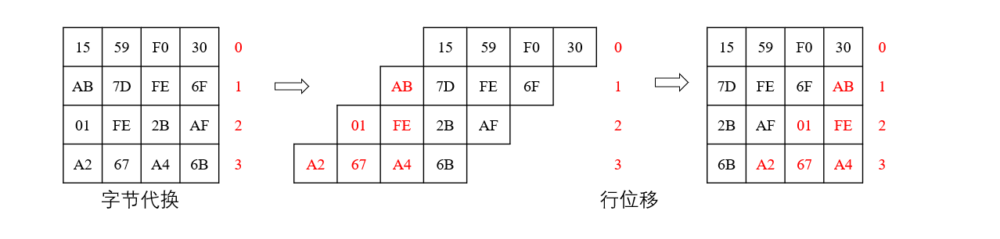

我们在之前的一些文章中可以发现，在Https协议中，可以使用DH算法或者RSA算法先使得客户端和服务端协商出一个秘钥，然后再用这个秘钥进行对称的加密通信。而 AES（Advanced Encryption Standard）复用是一种广泛使用的对称加密算法，采用分组加密方式，支持128、192和256位密钥长度。其加密过程基于多轮重复的变换操作。

# 一、加密

我们通过一个例子来剖析 AES 的加密过程，假设我们的数据是 `Eggsaregreatfood`，其大小为 16 Byte =  128 bit。这时不用分组，刚刚好。我们将他分为如下的矩阵

```c++
std::vector<std::vector<unsigned short int> > a = {
    {'E', 'a', 'r', 'f'},
    {'g', 'r', 'e', 'o'},
    {'g', 'e', 'a', 'o'},
    {'s', 'g', 't', 'd'},
};
```

## 1.1、种子秘钥与轮秘钥

首先，可以随机生成一个128bit的种子秘钥，再通过种子秘钥来生成10个轮秘钥，当然，种子秘钥的位数与轮秘钥个数相关

| 种子秘钥位数 | 轮秘钥个数 |
| ------------ | ---------- |
| 128bit       | 10         |
| 192bit       | 12         |
| 256bit       | 14         |


首先计算轮秘钥1，其中4的倍数列最复杂，所以先计算这个

### 轮秘钥4倍数列计算

首先计算第四列，第四列需要取出第三列的值，并做旋转字节，旋转字节就是整列向上旋转一位，最上面的 `6E` 转到最下面。

旋转字节以后还需要通过 `S-Box` 做字节替换，下面是一个常见的 `S-Box`：

|      | 0    | 1    | 2    | 3    | 4    | 5    | 6    | 7    | 8    | 9    | A    | B    | C    | D    | E    | F    |
| ---- | ---- | ---- | ---- | ---- | ---- | ---- | ---- | ---- | ---- | ---- | ---- | ---- | ---- | ---- | ---- | ---- |
| 0    | 63   | 7C   | 77   | 7B   | F2   | 6B   | 6F   | C5   | 30   | 01   | 67   | 2B   | FE   | D7   | AB   | 76   |
| 1    | CA   | 82   | C9   | 7D   | FA   | 59   | 47   | F0   | AD   | D4   | A2   | AF   | 9C   | A4   | 72   | C0   |
| 2    | B7   | FD   | 93   | 26   | 36   | 3F   | F7   | CC   | 34   | A5   | E5   | F1   | 71   | D8   | 31   | 15   |
| 3    | 04   | C7   | 23   | C3   | 18   | 96   | 05   | 9A   | 07   | 12   | 80   | E2   | EB   | 27   | B2   | 75   |
| 4    | 09   | 83   | 2C   | 1A   | 1B   | 6E   | 5A   | A0   | 52   | 3B   | D6   | B3   | 29   | E3   | 2F   | 84   |
| 5    | 53   | D1   | 00   | ED   | 20   | FC   | B1   | 5B   | 6A   | CB   | BE   | 39   | 4A   | 4C   | 58   | CF   |
| 6    | D0   | EF   | AA   | FB   | 43   | 4D   | 33   | 85   | 45   | F9   | 02   | 7F   | 50   | 3C   | 9F   | A8   |
| 7    | 51   | A3   | 40   | 8F   | 92   | 9D   | 38   | F5   | BC   | B6   | DA   | 21   | 10   | FF   | F3   | D2   |
| 8    | CD   | 0C   | 13   | EC   | 5F   | 97   | 44   | 17   | C4   | A7   | 7E   | 3D   | 64   | 5D   | 19   | 73   |
| 9    | 60   | 81   | 4F   | DC   | 22   | 2A   | 90   | 88   | 46   | EE   | B8   | 14   | DE   | 5E   | 0B   | DB   |
| A    | E0   | 32   | 3A   | 0A   | 49   | 06   | 24   | 5C   | C2   | D3   | AC   | 62   | 91   | 95   | E4   | 79   |
| B    | E7   | C8   | 37   | 6D   | 8D   | D5   | 4E   | A9   | 6C   | 56   | F4   | EA   | 65   | 7A   | AE   | 08   |
| C    | BA   | 78   | 25   | 2E   | 1C   | A6   | B4   | C6   | E8   | DD   | 74   | 1F   | 4B   | BD   | 8B   | 8A   |
| D    | 70   | 3E   | B5   | 66   | 48   | 03   | F6   | 0E   | 61   | 35   | 57   | B9   | 86   | C1   | 1D   | 9E   |
| E    | E1   | F8   | 98   | 11   | 69   | D9   | 8E   | 94   | 9B   | 1E   | 87   | E9   | CE   | 55   | 28   | DF   |
| F    | 8C   | A1   | 89   | 0D   | BF   | E6   | 42   | 68   | 41   | 99   | 2D   | 0F   | B0   | 54   | BB   | 16   |

替换时，`69` 就被替换为第6行第9列的数字。那么就可以得到经过旋转字节和字节替换的列3，计算列4时还需要轮常量，这个也是提前准备好的

| Index | 1    | 2    | 3    | 4    | 5    | 6    | 7    | 8    | 9    | 10   |
| ----- | ---- | ---- | ---- | ---- | ---- | ---- | ---- | ---- | ---- | ---- |
| 0     | 0x01 | 0x02 | 0x04 | 0x08 | 0x10 | 0x20 | 0x40 | 0x80 | 0x1B | 0x36 |
| 1     | 0x00 | 0x00 | 0x00 | 0x00 | 0x00 | 0x00 | 0x00 | 0x00 | 0x00 | 0x00 |
| 2     | 0x00 | 0x00 | 0x00 | 0x00 | 0x00 | 0x00 | 0x00 | 0x00 | 0x00 | 0x00 |
| 3     | 0x00 | 0x00 | 0x00 | 0x00 | 0x00 | 0x00 | 0x00 | 0x00 | 0x00 | 0x00 |

那么4的倍数列就可以通过以下公式进行计算
$$
列_{i} = 列_{i-4} \oplus (字节旋转+字节替换) 列_{i-1} \oplus 轮常量列
$$
整体过程如下图所示：


### 轮秘钥非4倍数列计算

非四倍数列的计算就好算多了，只需要列i-4和列i-1进行异或即可
$$
列_{i} = 列_{i-1} \oplus 列_{i-4}
$$
以第五列为例：


通过C++可以获得计算好的秘钥，这部分代码我们在最后提供

```shell
6a 74 65 6e 92 e6 83 ed 28 ce 4d a0 fa 34 79 d9 4e 7a 03 da 5c 26 25 ff 12 34 11 ee 37 03 12 fc e1 e2 f0 0c 10 f2 02 0e 70 82 80 8e
69 61 69 69 fb 9a f3 9a b9 23 d0 4a c1 e2 32 78 c2 20 12 6a 1d 3d 2f 45 eb d6 f9 bc 2a fc 05 b9 fb 07 02 bb 07 00 02 b9 0f 0f 0d b4
6e 69 6a 74 81 e8 82 f6 5d b5 37 c1 96 23 14 d5 0d 2e 3a ef 2d 03 39 d6 31 32 0b dd b5 87 8c 51 0f 88 04 55 66 ee ea bf e6 08 e2 5d
69 6d 69 61 f6 9b f2 93 a3 38 ca 59 43 7b b1 e8 76 0d bc 54 21 2c 90 c4 37 1b 8b 4f 1f 04 8f c0 af ab 24 e4 51 fa de 3a fa 00 de e4
```


## 1.2、加密过程

### 轮秘钥加

将明文与种子进行按位异或运算，这一步称为轮秘钥加


### 字节代换

还是之前的步骤，查询 `S-Box` 表格进行字节代换


### 行位移

第0行不移位，第1行移动一位，以此类推



### 列混淆

列混淆很像矩阵乘法，只是相加变成了异或，同时引入了混淆矩阵


### 轮秘钥加

也就是将列混淆后生成的矩阵再次进行秘钥加操作，只是这次不再与种子秘钥相加，而是第一个轮秘钥，因为种子秘钥已经加过了。


需要注意的是，第十轮并不存在列混淆。


# 二、解密

理解了加密以及加密中的种种概念，解密也就不难理解了，只是一个加密的逆过程


- 行位移是向左移动，那么行位移求逆就是向右移动
- 字节代换求逆就是使用逆 `S-Box`
- 秘钥轮加的概念是不变的
- 列混淆求逆就是与混淆矩阵的逆矩阵相乘


其中S-Box逆矩阵如下所示

|      | 0    | 1    | 2    | 3    | 4    | 5    | 6    | 7    | 8    | 9    | A    | B    | C    | D    | E    | F    |
| ---- | ---- | ---- | ---- | ---- | ---- | ---- | ---- | ---- | ---- | ---- | ---- | ---- | ---- | ---- | ---- | ---- |
| 0    | 63   | 7C   | 77   | 7B   | F2   | 6B   | 6F   | C5   | 30   | 01   | 67   | 2B   | FE   | D7   | AB   | 76   |
| 1    | CA   | 82   | C9   | 7D   | FA   | 59   | 47   | F0   | AD   | D4   | A2   | AF   | 9C   | A4   | 72   | C0   |
| 2    | B7   | FD   | 93   | 26   | 36   | 3F   | F7   | CC   | 34   | A5   | E5   | F1   | 71   | D8   | 31   | 15   |
| 3    | 04   | C7   | 23   | C3   | 18   | 96   | 05   | 9A   | 07   | 12   | 80   | E2   | EB   | 27   | B2   | 75   |
| 4    | 09   | 83   | 2C   | 1A   | 1B   | 6E   | 5A   | A0   | 52   | 3B   | D6   | B3   | 29   | E3   | 2F   | 84   |
| 5    | 53   | D1   | 00   | ED   | 20   | FC   | B1   | 5B   | 6A   | CB   | BE   | 39   | 4A   | 4C   | 58   | CF   |
| 6    | D0   | EF   | AA   | FB   | 43   | 4D   | 33   | 85   | 45   | F9   | 02   | 7F   | 50   | 3C   | 9F   | A8   |
| 7    | 51   | A3   | 40   | 8F   | 92   | 9D   | 38   | F5   | BC   | B6   | DA   | 21   | 10   | FF   | F3   | D2   |
| 8    | CD   | 0C   | 13   | EC   | 5F   | 97   | 44   | 17   | C4   | A7   | 7E   | 3D   | 64   | 5D   | 19   | 73   |
| 9    | 60   | 81   | 4F   | DC   | 22   | 2A   | 90   | 88   | 46   | EE   | B8   | 14   | DE   | 5E   | 0B   | DB   |
| A    | E0   | 32   | 3A   | 0A   | 49   | 06   | 24   | 5C   | C2   | D3   | AC   | 62   | 91   | 95   | E4   | 79   |
| B    | E7   | C8   | 37   | 6D   | 8D   | D5   | 4E   | A9   | 6C   | 56   | F4   | EA   | 65   | 7A   | AE   | 08   |
| C    | BA   | 78   | 25   | 2E   | 1C   | A6   | B4   | C6   | E8   | DD   | 74   | 1F   | 4B   | BD   | 8B   | 8A   |
| D    | 70   | 3E   | B5   | 66   | 48   | 03   | F6   | 0E   | 61   | 35   | 57   | B9   | 86   | C1   | 1D   | 9E   |
| E    | E1   | F8   | 98   | 11   | 69   | D9   | 8E   | 94   | 9B   | 1E   | 87   | E9   | CE   | 55   | 28   | DF   |
| F    | 8C   | A1   | 89   | 0D   | BF   | E6   | 42   | 68   | 41   | 99   | 2D   | 0F   | B0   | 54   | BB   | 16   |

# 三、为什么快

现代 CPU（如 x86 的 AES-NI 指令集）直接提供 AES 的硬件加速，单条指令完成一轮操作。也就是说，AES作为现代对称加密的标准之一，他已经直接被硬件支持了。

